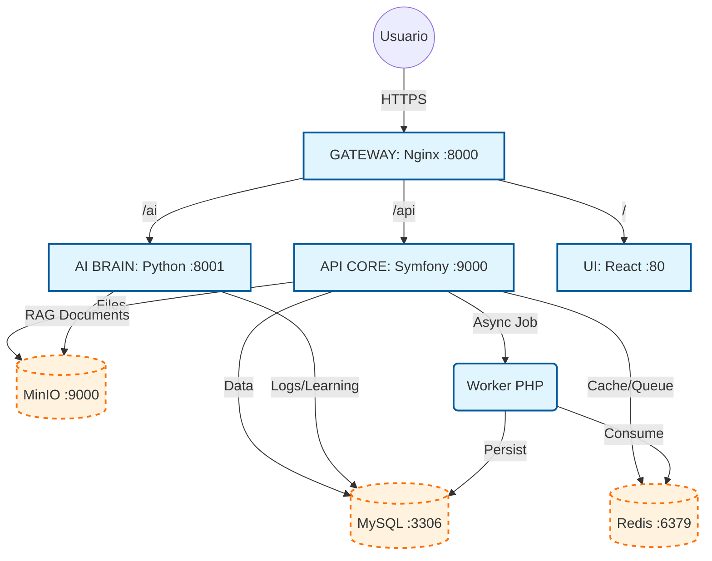
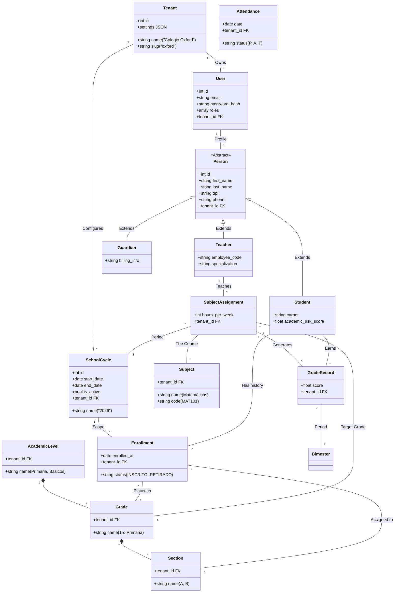

# 🗺️ Mapa Arquitectónico de Corpo Oxford

Este documento sirve como la fuente de verdad técnica para la arquitectura de la plataforma **Corpo Oxford**. Describe la infraestructura, el modelo de datos y los flujos operativos.

## 1. Stack Tecnológico

| Capa | Tecnología | Versión | Rol |
| :--- | :--- | :--- | :--- |
| **Frontend** | React + Vite + Tailwind | 18+ | Interfaz de Usuario (SPA) |
| **Backend** | Symfony (PHP) | 6.4/7.0 | API REST, Lógica de Negocio |
| **AI Layer** | Python (FastAPI/LangChain) | 3.10+ | Procesamiento Lenguaje Natural (Rhema) |
| **Database** | MySQL | 8.0 | Almacenamiento Relacional (Strict Mode) |
| **Cache/Queue**| Redis | 7.x | Cache, Sesiones, Mensajería Asíncrona |
| **Storage** | MinIO (S3 Compatible) | Latest | Almacenamiento de Archivos (Fotos, Docs) |
| **Gateway** | Nginx | 1.25 | Reverse Proxy, SSL Termination |

---

## 2. Infraestructura (Contenedores)

El sistema se despliega mediante **Docker Compose**. Todos los servicios se comunican dentro de la red interna `app_net`.

---

## 3. Modelo de Datos (Esquema Multi-Tenant)

El núcleo del sistema es la **Arquitectura Multi-Tenant** donde una sola base de datos (`oxford_db`) aloja a múltiples colegios (`Tenant`), pero los datos están estrictamente segregados lógicamente.

### Diagrama de Entidades (ERD Maestro)

---

## 4. Flujos Críticos

### A. Autenticación y Resolución de Tenant
1. **Login**: Usuario envía credenciales a `/api/login_check`.
2. **JWT**: Backend valida y emite un Token JWT que incluye `{"tenant_id": 1, "slug": "oxford"}`.
3. **Guard**: Para peticiones subsiguientes (`Bearer Token`), el `TenantListener` intercepta la petición.
4. **Filtro**: Se activa `TenantFilter` de Doctrine, inyectando `AND tenant_id = 1` en **todas** las consultas SQL automáticamente.

### B. Inscripción (Enrollment)
1. **Secretaria** selecciona un Estudiante existente o crea uno nuevo.
2. Selecciona el **Ciclo Escolar** activo y el **Grado** destino.
3. Se crea registro en tabla `enrollment`.
4. El sistema valida cupos (futuro) y genera cargos financieros (si aplica).

### C. Calificaciones (Grading)
1. **Docente** ve sus cursos (`SubjectAssignment`).
2. Selecciona un curso (ej. Matemáticas).
3. Backend consulta `enrollment` filtrando por el Grado del curso.
4. Docente ingresa notas para el Bimestre activo.
5. Se guardan en `grade_record`.

---

## 5. Módulo de IA (Rhema)
El servicio de IA (`ai_service`) corre independiente pero comparte la base de datos MySQL.

- **Memoria**: Lee/Escribe en tabla `ai_interactions` y `ai_memory` en MySQL.
- **Contexto**: Al recibir una pregunta, consulta (RAG) documentos en MinIO y reglas en MySQL (`institutional_rules`).
- **Feedback**: El sistema aprende de correcciones explícitas guardadas en `ai_feedback`.
