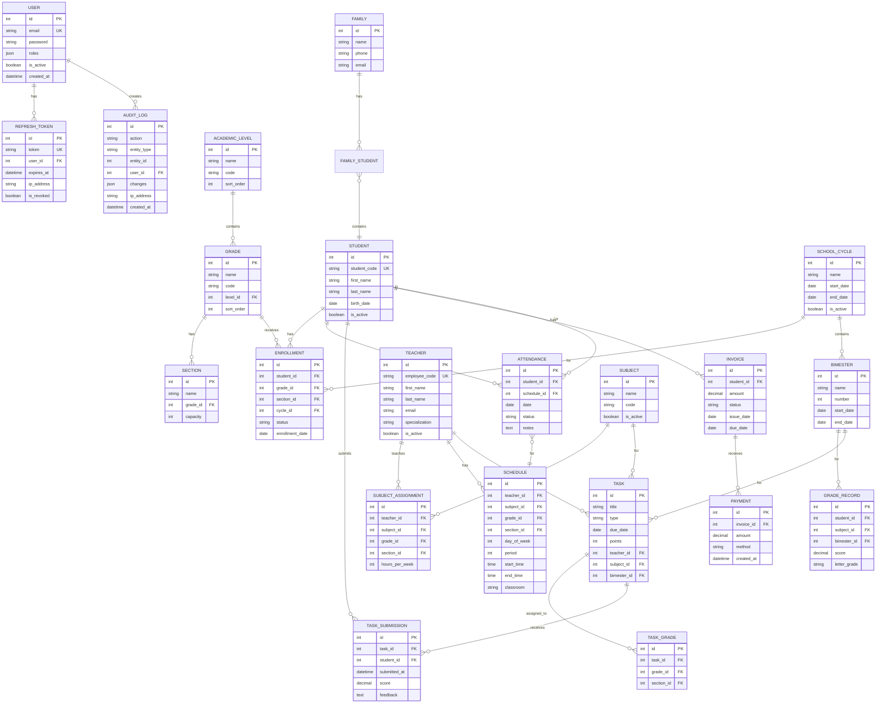

# Sistema Oxford - Entity Relationship Diagram

## Database Schema Overview

## Table Summary

| Category | Tables | Description |
|----------|--------|-------------|
| Auth | user, refresh_token | Authentication and sessions |
| Academic | grade, section, subject, enrollment | School structure |
| People | student, teacher, family | Actors |
| Schedule | schedule, attendance | Time management |
| Tasks | task, task_grade, task_submission | Assignments |
| Grades | grade_record, bimester | Academic records |
| Financial | invoice, payment | Billing |
| Audit | audit_log | Activity tracking |

## Key Relationships

1. **Student → Enrollment → Grade/Section**: Students enroll in specific grade and section
2. **Teacher → Subject Assignment → Subject/Grade**: Teachers assigned to teach subjects
3. **Schedule → Teacher + Subject + Grade**: Class schedule entries
4. **Task → Task Grade**: Tasks assigned to multiple grades
5. **Task → Task Submission**: Student submissions and grading
